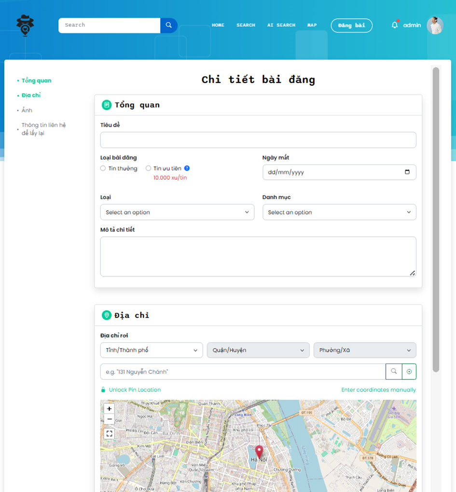

# Lost & Found AI Application

A modern online platform to help users post and search for lost or found items, integrated with AI for enhanced image and text-based search capabilities. Built with a microservices architecture, it leverages React, ASP.NET Core, Docker, and AI models like SentenceTransformer (CLIP-ViT-B-32) with FAISS for similarity search.

## Features
- **User Features**:
  - Register/login with email or third-party accounts (Google, Facebook).
  - Post, edit, or delete lost/found item listings with images, descriptions, and GPS locations.
  - AI-powered search by image or text description.
  - Comment, follow, and share posts on social media (e.g., Facebook).
  - Payment integration (VNPay, PayOS) for premium post prioritization.
  - GPS-based location filtering and map visualization.
  - User profile management and transaction history.

- **Admin Features**:
  - Dashboard with analytics (user count, posts, revenue).
  - Manage posts, categories, user roles, and reports.
  - Process AI embeddings for search functionality.

## Tech Stack
- **Frontend**: React, Bootstrap
- **Backend**: ASP.NET Core, Microservices, REST API, RabbitMQ, SignalR
- **Database**: SQL Server, SQLite (for AI embeddings)
- **AI**: SentenceTransformer (CLIP-ViT-B-32), FAISS
- **Deployment**: Docker, Google Colab, Ngrok
- **Version Control**: Git, GitHub

## Source
- Backend, AI: https://github.com/HQuoan/BackToYou
- Frontend: https://github.com/HQuoan/BackToYou_Web

## Microservices Application Flow Diagram

## NGINX Application Flow Diagram

## Database

## Screenshots

### User Login Page

### Homepage

### Categories

### Latest Posts

### Search Page

### Post Map

### AI Search

### Post Details

### Create Post

### User Profile

### Wallet & Transaction History

### Post History

### Admin Login Page

### Admin Dashboard

### Admin Dashboard (Dark Mode)

### Post Management

### Post Processing

### Report Management

### User Management

### Admin Profile

## API Documentation
- API endpoints are documented using Swagger/OpenAPI.
- AI Service endpoints: `/embedding`, `/delete_post_embeddings`, `/compare`.
